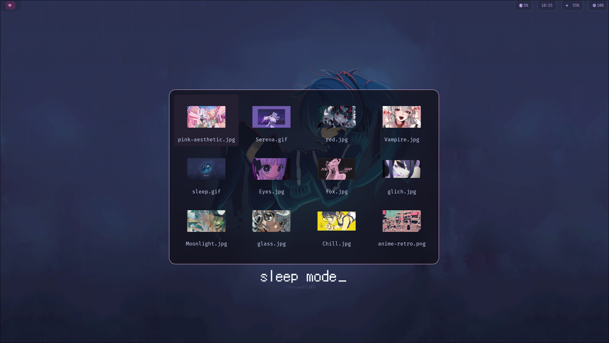
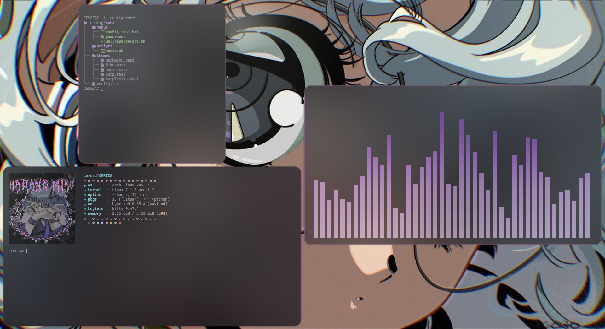
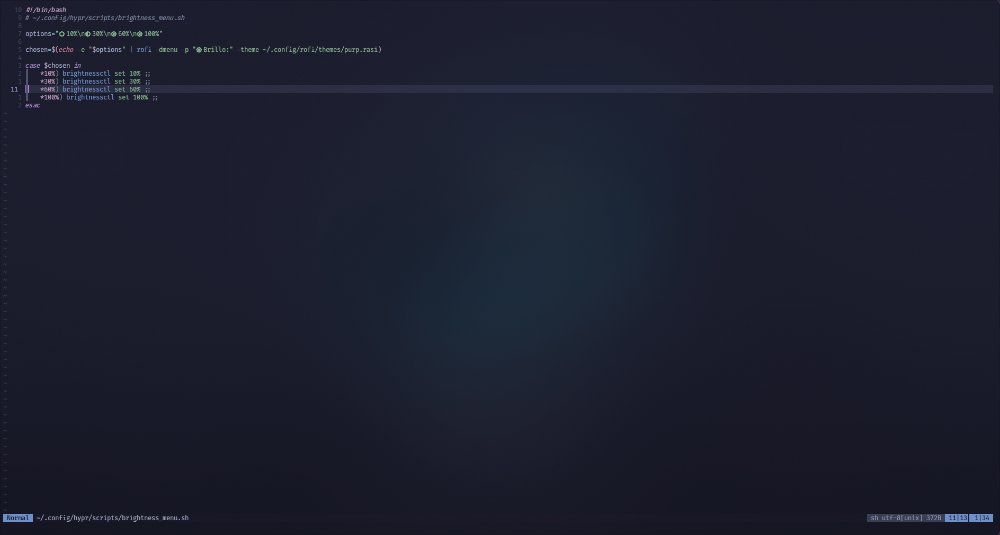
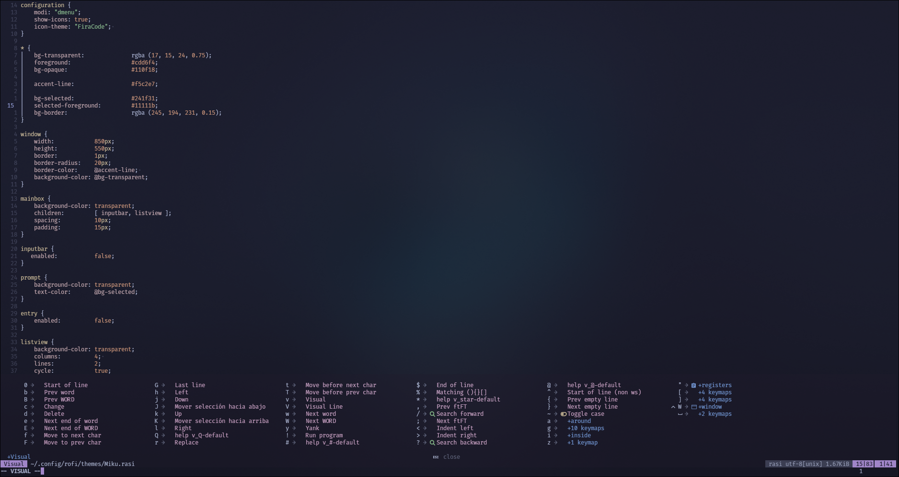

<div align="center">

# 🏔️ dotfiles — Arch Linux + Hyprland

*Mi configuración personal de escritorio, minimalista y funcional.*


</div>

---

## 📑 Tabla de contenido

- [✨ Features](#-features)
- [🧰 Stack](#-stack)
- [📋 Requisitos previos](#-requisitos-previos)
- [🚀 Instalación](#-instalación)
- [🖼️ Capturas](#️-capturas)
- [⌨️ Keybinds](#️-keybinds)
- [🙌 Créditos](#-créditos)

---

## ✨ Features

- 🎨 Selector de wallpapers integrado
- 🪟 Configuración de Hyprland optimizada (tiling, gaps, animaciones)
- 🔍 Rofi como launcher principal
- 📝 Neovim configurado con explorador de archivos y búsqueda
- 🗂️ Dolphin como gestor de archivos
- ⌨️ Atajos de teclado pensados para productividad

## 🧰 Stack

| Componente        | Herramienta   |
|--------------------|--------------|
| Window Manager     | Hyprland 0.55.4 |
| Launcher           | Rofi          |
| Editor             | Neovim        |
| Gestor de archivos | Dolphin       |
| Terminal           | Kitty         |
| Barra de Estado    | Waybar        |
| Gestor de inicio   | SDDM          |
| Shell              | Zsh           |
## 📋 Requisitos previos

Antes de clonar, asegúrate de tener:

- **Arch Linux** (o derivada) recién instalado o funcional
- `git` instalado: `sudo pacman -S git`
- Drivers de GPU correctamente configurados
- Conexión a internet activa

## 🚀 Instalación

> ⚠️ **Aún no hay script de instalación automatizado.** Por ahora la instalación es manual. Revisa cada archivo antes de aplicarlo a tu sistema.

1. **Clona el repositorio**

   ```bash
   git clone https://github.com/cerezas1/dotfiles.git ~/dotfiles
   cd ~/dotfiles
   ```

2. **Revisa las dependencias necesarias** (Hyprland, Rofi, Neovim, Dolphin, etc.) e instálalas con `pacman`/`yay`:

   ```bash
   sudo pacman -S hyprland rofi neovim dolphin
   ```

3. **Haz respaldo de tu configuración actual** antes de sobrescribir nada:

   ```bash
   cp -r ~/.config ~/.config.backup
   ```

4. **Copia o enlaza las configuraciones** a `~/.config`:

   ```bash
   cp -r ~/dotfiles/<carpeta-config> ~/.config/
   ```

5. **Reinicia tu sesión de Hyprland** para aplicar los cambios.

> 💡 Próximamente: un `install.sh` que automatice todo esto con symlinks, backup automático y detección de dependencias.

## 🖼️ Capturas

### Selector de Wallpapers


### Terminal


### Neovim



## ⌨️ Keybinds

<details>
<summary><strong>General</strong></summary>

| Acción            | Atajo          |
|:-------------------|:---------------|
| Abrir Terminal      | `Mod + Q`      |
| Cerrar Ventana       | `Mod + C`      |
| Rofi Menu            | `Mod + R`      |
| PowerMenu            | `Mod + Esc`    |
| Dolphin              | `Mod + E`      |

</details>

<details>
<summary><strong>Cambiar foco</strong></summary>

| Acción                | Atajo            |
|:------------------------|:-----------------|
| Foco a la izquierda     | `Mod + ←`         |
| Foco a la derecha        | `Mod + →`         |
| Foco hacia arriba        | `Mod + ↑`         |
| Foco hacia abajo         | `Mod + ↓`         |

</details>

<details>
<summary><strong>Workspaces</strong></summary>

| Acción                  | Atajo               |
|:--------------------------|:--------------------|
| Desplazarse entre 1-9       | `Mod + 1-9`          |
| Mover ventana a workspace   | `Mod + Shift + 1-9`  |

</details>

<details>
<summary><strong>Volumen</strong></summary>

| Acción           | Atajo   |
|:-------------------|:--------|
| Subir volumen       | `F12`   |
| Bajar volumen       | `F11`   |

</details>

<details>
<summary><strong>Wallpaper</strong></summary>

| Acción                  | Atajo       |
|:--------------------------|:------------|
| Seleccionar wallpaper       | `Mod + W`   |
| Siguiente wallpaper         | `Mod + B`   |
| Wallpaper anterior          | `Mod + N`   |

</details>

## 🙌 Créditos

Hecho con ☕ por [cerezas1](https://github.com/cerezas1).
